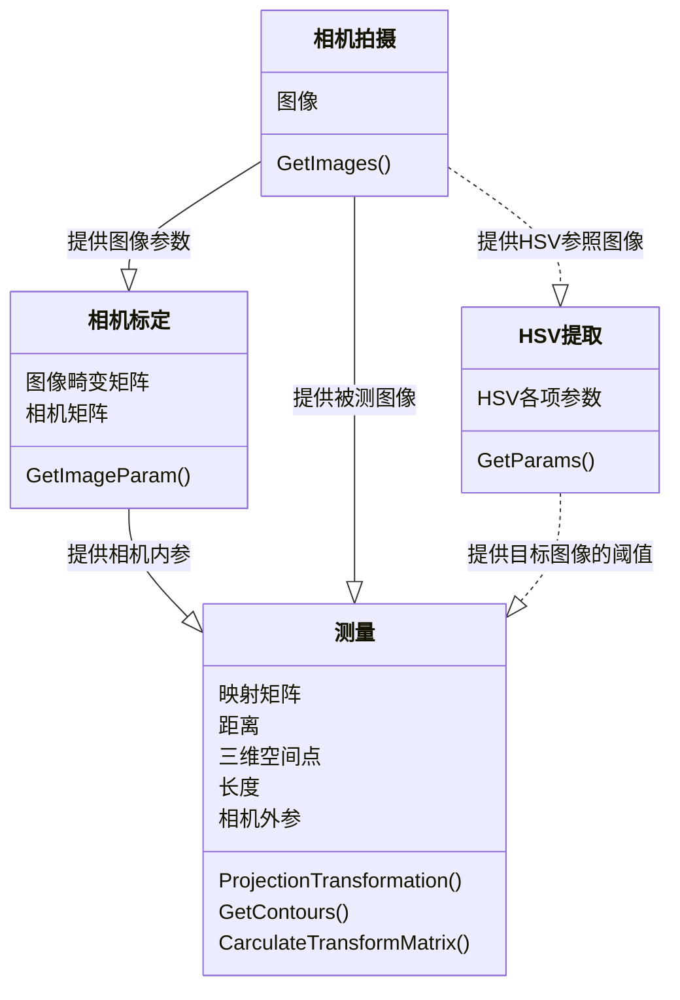
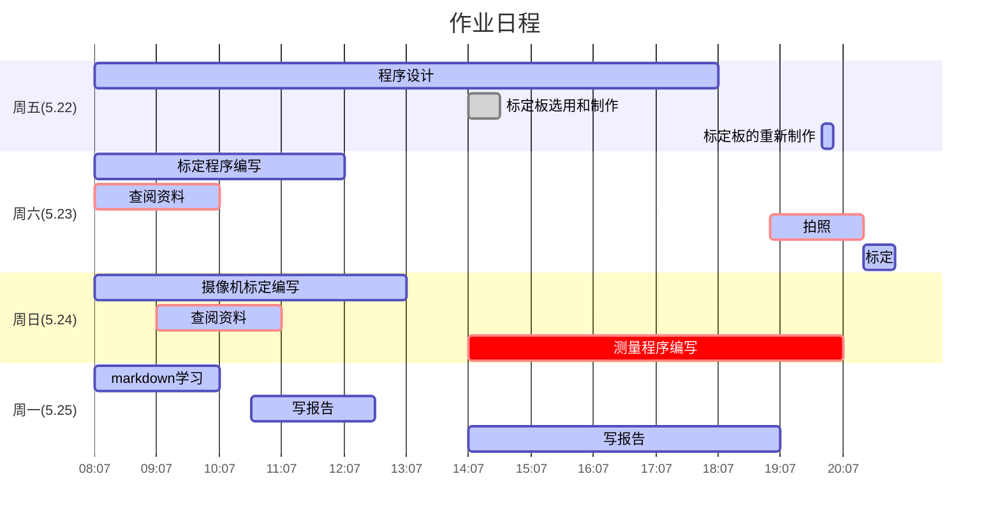

# :place_of_worship: 标定平面测距

---

用matlab标定摄像机以后，用python在标定平面内建立世界坐标系并测距:sailboat:

:star2:由于是很早写的代码了，里面文件好多都没有用相对路径，可移植性可能比较差，建议使用相对路径:cake:

:star2:里面的标定板是一个可变参数，随着你标定板正方形边长改变而改变:golf:

:star2:用halcon会比这个快很多，但是我看到之前没有人用opencv做，我就尝试自己做了一下:goal_net:

:star2:代码就看后面附录吧，就不单独整理出来了:smile:

:star2::star2::star2:强烈建议用typora查看！！！！我好多东西都没有完完全全显示出来（比如latex文本，还有好多Typora好多内置的语句），如果不想用typora看的话，那就用html看吧~:sassy_man:

---


[toc]


<div STYLE="page-break-after: always;"></div>

# 1设计任务

## 1.1任务要求

摄像机标定要求自制标定板，使用网络摄像机或手机摄像头进行标定。将标定的摄像机内参和外参进行保存。设计测量方案，使用标定过的摄像机对包含垂直边缘的物品（直尺刻度线，矩形物体边缘等）进行距离或边长的测量。标定过程和测量过程，均需要保持摄像机与测量平面之间的距离固定，物品高度不能过高，否则影响测量结果。给出设计的中间过程和截图以及最终测量结果，并对测量结果进行误差计算和分析。根据任务书要求，完成以下设计任务：

系统整体方案设计，包括

1. 课题分析，设计测量方案，测量对象的确定；
2. 系统总体结构框图（或流程图）。

结合Halcon（或open CV）软件，写出各功能模块的实现及相应的代码。

1. 标定板制作；
2. 摄像机标定；
3. 对设计方案中垂直于测量矩形框的直边进行提取，并测量直边之间的距离，从而得到平面测量对象的尺寸；
4. 对测量值与实际尺寸误差进行一定的分析和改进
5. 多次测量，计算出测量的平均值和标准差

<div STYLE="page-break-after: always;"></div>

## 1.2任务分析

本次任务主程序可以分为三块:相机拍摄，相机标定，测量三大块。其中，相机拍摄为相机标定主要任务是获取图像，存储的是图像的参数；相机标定的主要任务是获取相机的内参；在测量里面，我们需要用标定板来确定相机的外参，然后由于我们在测量图像外参的时候，默认将标定板作为参考坐标系，所以只要将相机成像平面中的点投影到Z=0时的成像平面就可以了。

由于本次实验我采用的是选用红色来做测量的对象，所以我需要对图像阈值做出提取，比如，我在这里就进行了HSV提取。



大致的设计方案如上图所示。

<div STYLE="page-break-after: always;"></div>

# 2设计原理

## 2.1相机的成像原理

我们熟知的摄像机是由光线透过透镜折射，反射到成像平面形成的，本质是利用二维图像获取三维信息的过程。所以我们可以通过成像的状况来反映三维世界中的信息。


但是，现实模型总会与理想模型存在一些偏差，这里的偏差主要就是相机内参与畸变系数所导致的。由于每一个相机都是利用的透镜成像原理，所以很容易产生桶形畸变或者是枕形畸变。所以一个三维的图像到OpenCV显示的画面需要经历三个变化，这三个变化对应的参数分别是相机位姿参数，畸变技术，相机内参。由此可得：
$$
Z_c\left[ \begin{array}{1}u\\v\\1\end{array}\right]=\left[\begin{array}{3}\frac{1}{dx}&0&u_0\\0&\frac{1}{dy}&v_0\\0&0&1\end{array}\right]\left[\begin{array}{4}f&0&0&0\\0&f&0&0\\0&0&1&0\end{array}\right]\left[\begin{array}{2}R&t\\0^T&1\end{array}\right]\left[\begin{array}{1}X\\Y\\Z\\1\end{array}\right]\tag{1}
$$
其中$\left[\begin{array}{2}R&t\\0^T&1\end{array}\right]\left[\begin{array}{1}X\\Y\\Z\\1\end{array}\right]$表示的是相机与世界的关系，$\left[\begin{array}{4}f&0&0&0\\0&f&0&0\\0&0&1&0\end{array}\right]\left[\begin{array}{2}R&t\\0^T&1\end{array}\right]\left[\begin{array}{1}X\\Y\\Z\\1\end{array}\right]$表示的是三维空间与投影的关系，等式的右边，也就是$\left[\begin{array}{3}\frac{1}{dx}&0&u_0\\0&\frac{1}{dy}&v_0\\0&0&1\end{array}\right]\left[\begin{array}{4}f&0&0&0\\0&f&0&0\\0&0&1&0\end{array}\right]\left[\begin{array}{2}R&t\\0^T&1\end{array}\right]\left[\begin{array}{1}X\\Y\\Z\\1\end{array}\right]$表示的是像素平面与三维空间的关系。经过三个矩阵的变化，我们就可以得到相机在摄像平面内像素的坐标位置。

## 2.2深度的测量原理

但是，由于我们课题内使用的是一个单目摄像机，如果不移动相机，我们是无法获取三维平面内的尺度信息和深度信息的。但是我们可以获取三维平面内的比例关系。这时候我们需要知道更多的参数。

在这次的课题里面，我们需要的参数有两个，一个是相机的位姿参数，一个是成像平面。知道了这两个参数，我们就可以将摄像机内二维平面内的点投射到三维的坐标中去，再利用三维坐标轻松算出点与点之间的距离。这个课题里面，我们默认将世界坐标系的原点放在标定板第一个角点上。所以，我们只需要将成像平面设置为Z=0，即XOY面就可以了，这时我们便获得了需要计算深度信息的所有参数。

<div STYLE="page-break-after: always;"></div>

# 3方案及各个功能模块的设计

## 3.1硬件部分设计

### 3.1.1标定板的制作

标定板采用的是MATLAB制作的，MATLAB里面输入如下代码：

```matlab
J=(checkerboard(300,4,5)>0.5);
figure,imshow(J);
```

就可以制作出如下图所示的标定板：


然后在网上查阅资料可以知道，iPad的屏幕宽度是196.6mm。


如上图所示，iPad宽度上的方格数是8个，所以每个方格的长度是$196.6mm\div 8=24.575mm$。摄像机标定部分，首先我用opencv + python部分写了一个存储图像的代码，作为标定摄像机的模块。

测量时返回摄像机位姿的标定板摆放：


### 3.1.2标定图像的制作

为了方便测量，我选用了一个红色的长方形来做测量的模块。如下图所示：


实际长度在118.4-118.5毫米。

## 3.2软件部分设计

### 3.2.1程序总流程图设计

```flow
st=>start: 开始
photo=>subroutine: 拍摄图像
calib=>subroutine: 相机标定
measure=>subroutine: 测量
end=>end: 结束

st->photo
photo->calib
calib->measure
measure->end
```

如上图所示，程序的主流程图先是拍摄图像，然后根据图像的拍摄结果进行相机的内参标定，测量目标图像。

### 3.2.2拍摄图像部分流程图设计

```flow
st=>start: 开始
get=>operation: 获取摄像头图像
savepath=>operation: 设置图像保存路径

detect=>operation: 检测按键
camera=>operation: 获取图像
cond1=>condition: 检测到按键为‘s’？
cond2=>condition: 检测按键为‘q’？
save=>operation: 保存图像
ed=>end: 结束

st->get(right)->savepath->detect
detect->camera->cond1
cond1(no)->cond2
cond1(yes,right)->save(right)->detect
cond2(yes)->ed
cond2(no)->detect


```

如上图所示，拍摄图像的步骤很简单，主要是采用了Mac的内置摄像头部分，检测按键来进行拍照。如果检测的按键是“s‘的话，那么将图像保存在存储路径里面，如果检测到的按键是”q“的话，那么退出图像的检测环节。

### 3.2.3相机标定的流程图设计

```flow
st=>start: 开始
read=>operation: 读取图像
gray=>operation: 将图像转变为灰度图
coner=>operation: 寻找角点
cond1=>condition: 找到角点？
take=>operation: 把角点列入参照点
sss=>operation: 存储角点
show=>operation: 显示角点
find=>condition: 找到足够的角点？
calib=>operation: 标定
end=>end: 结束

st->read->gray->coner(right)->cond1
cond1(no,right)->find(no)->coner
find(yes)->show->calib(right)->end
cond1(yes)->take->sss(left)->coner
```

如上图所示，相机标定主要是对棋盘角点的寻找，然后再储存角点，如果储存到了足够多的角点的话，就退出程序的循环，进行标定。

### 3.2.4测量的流程图设计

```flow
st=>start: 开始
read=>operation: 读取相机的内参，标定平面图像
open=>operation: 根据标定板读取相机外参
read2=>operation: 读取待测图像
measure=>subroutine: 计算实际长度
cond1=>condition: 图像是否读取完毕？
end=>end: 结束，并打印输出结果

st->read(right)->open->read2->measure(right)->cond1
cond1(yes)->end
cond1(no)->read2
```


如上图所示，程序的主要思路是根据标定板得到相机的外参，然后根据摄像机的外参来计算目标图像的参数。秉持着严谨的思想，我采用了旋转被测物体，多次测量求平均值的方法，在之后的数据分析中，也需要将异常数值剔除。

### 3.2.5计算距离的流程图设计

```flow
st=>start: 入口
mask=>operation: 将图像HSV提取，提取出目标方块
contour=>operation: 提取目标的轮廓
max_con=>operation: 遍历所有的轮廓找出最大的轮廓
approxPlo=>operation: 拟合一个四边形，获取角点
world=>operation: 将角点投射到世界坐标系中
dis=>operation: 计算距离&并打印输出结果
end=>end: 出口

st->mask->contour(right)->max_con->approxPlo(right)->world->dis->end


```

如图所示，这里用到的方法是根据提取出来的轮廓拟 q合一个四边形，根据拟合出来的四边形得出其角点，根据角点变换到3为坐标中去，根据三维坐标系中的点来计算距离参数，并返回。

### 3.2.6附加程序(HSV):提取的流程图设计

```flow
st=>start: 开始
read=>operation: 读取图像
build=>operation: 建立一个HSV滑块
m=>operation: 读取滑块数值
kk=>operation: 根据滑块的阈值分割图像
jk=>condition: 检测到的按键为q?
op=>operation: 输出HSV阈值的大小
end=>end: 结束
st->read->build(right)->m->kk(right)->jk
jk(no)->m
jk(yes)->op->end
```

如图所示，这个程序的目的是，检测到HSV空间里的阈值，使其能够正好将目标图像的正方体区分开来，然后在提取HSV数值以后，返回一个阈值列表。

## 3.3部分重要代码分析

### 3.3.1拍摄部分

```python
if key == ord('s'):
		cv.imwrite(filepath +img_name + str(a)+'.png',frame)     # 按s截取图像
		a = a + 1               # 改变截取图像的名称
if key == ord('q'):
		break                   # 如果检测到按键为esc，就退出摄像
```

这里是个保存图像的函数，如果检测到按键是”s“，那么将图像保存在相应的路径里面，如果检测到按键按下的是”q“，则退出循环，关闭摄像机。

### 3.3.2相机内参标定部分

```python
ret, corners = cv2.findChessboardCorners(gray, (7,5), None)
# 如果找出角点，把角点加入坐标系内
if ret == True:
    objpoints.append(objp*30)
    # 参照criteria进行亚像素检验
    corners2 = cv2.cornerSubPix(gray,corners,(11,11),(-1,-1),criteria)
    imgpoints.append(corners2)
    # 将角点显示出来
    img = cv2.drawChessboardCorners(img, (7,5), corners2,ret)
    cv2.imwrite(sys.path[0]+"/标定结果/"+"result"+ str(a)+".png", img)
    a = a+1
```

findChessboardCorners是一个检测标定板角点的函数，如果检测到了角点，就以criteria的规则进行亚像素检验，然后再将所有的角点储存下来，将检测到的角点显示并且将显示角点的图像保存下来。

```python
if fname == images[-1]:
    ret, mtx, dist, rvecs, tvecs = cv2.calibrateCamera(objpoints, imgpoints, gray.shape[::-1],None,None)
```

这里的主要目的是在最后一次的标定后，针对角点及其对应点进行摄像机内参的标定。

### 3.3.3测量部分

```python
if Find:
    # 获取更精确的角点位置(亚像素精度)
    exact_corners = cv2.cornerSubPix(gray,corners,(11,11),(-1,-1),criteria)
    # 获取外参，其中rvec是旋转矩阵，tvec是平移矩阵
    _,rvec, tvec, inliers = cv2.solvePnPRansac(world_point, exact_corners, IntrinsicMatrix, distC
    # 获取两个平面(像素平面与实际平面)的映射关系,其中RMat是相机平面到Z=0轴的投影
    Mat = cv2.findHomography(D_2_point, exact_corners)[0]
    RMat = cv2.findHomography(exact_corners, D_2_point)[0]
    
    #print(np.transpose(np.dot(Mat,[[24.575*3,0],[0,24.575*3],[1,1]])))
    # 这里打印的是一个投影的值
    # 根据3D坐标，获取投影的二维坐标
    imgpts, jac = cv2.projectPoints(axis, rvec, tvec, IntrinsicMatrix, distCoeffs)
    # 可视化角点，画出图像
    img = draw(image, corners, imgpts)
    # cv2.imshow('img', img)
    return [Mat,RMat,corners,imgpts]
```

同样的，这里依然进行摄像机标定，不过这里进行的是摄像机外参的标定，通过投影的方法找到相机的内参和外参，再返回一个相机位姿矩阵。

```python
contours, hierarchy = cv2.findContours(image_2, cv2.RETR_TREE, cv2.CHAIN_APPROX_SIMPLE)
for contour in contours:
    arclength = cv2.arcLength(contour, True)
    # print(arclength)
    a.append(arclength) # 长度保存在数组中
maxlen = max(a)
for contour in contours:
    arclength = cv2.arcLength(contour, True)
    if arclength == maxlen:
        dot = cv2.approxPolyDP(contour,5,True)
        dot = np.int0(dot)
        cv2.drawContours(image, [dot], 0, (0, 0, 0), 1)
```

用HSV参数进行阈值化处理后，findContours作用是找出目标物体的外轮廓，返回的contour是轮廓的点集。考虑到在图像里面会有很多干扰点，所以我们要将最大的轮廓给过滤出来。approxPolyDP表示的是多边形拟合，在这个函数中，返回的是图像中四边形的四个角点。根据图像里面返回的四个角点，以及相机位姿及其内参，三维空间里平面参数，我们很容易将图像的几个点在三维空间里面描述出来。也就很容易知道四边形对应的矩形几个边的边长了。

<div STYLE="page-break-after: always;"></div>

# 4结果分析及总结

## 4.1程序运行结果

### 4.1.1拍摄部分

拍出来以下的图像以备相机内参标定：


拍出以下图片准备外参标定：


拍出以下图片准备测量长度：


### 4.1.2相机标定部分

MATLAB结合标定出来的位姿，用MATLAB作图如下，一共选取了5张图像作为标定的图像：


测量出来的相机内参矩阵为：$\left|  \begin{array}{ccc} 916.2197&0&622.7878\\0&914.8909&261.5797\\0&0&1 \end{array}  \right|$，在程序里面用IntrinsicMatrix来表示。

相机畸变矩阵为：$\left| \begin{array}{1}-0.1671\\0.9553\\0\\0\\0\end{array}\right|$，在程序里面用distCoeffs表示。

### 4.1.3测量部分：

输出的结果如下所示：

> 世界坐标下的角点：
>
> [[137.88112481  -4.24766315   0.        ]
>
> [ 28.53543319  40.02809197   0.        ]
>
> [ 55.77381169 108.36633628   0.        ]
>
> [165.90828778  64.39100409   0.        ]]
>
> 长方形边长的集合：
>
> [ 73.5666018   74.14032982 117.96958408 118.58934466]
>
> 取平均数:
>
> 宽： 73.85346580588386 毫米
>
> 长： 118.27946436719735 毫米
>
> 
>
> 世界坐标下的角点：
>
> [[ 66.02325053   2.18656177   0.        ]
>
> [ 30.74511718  66.73356836   0.        ]
>
> [135.16197346 123.50090902   0.        ]
>
> [170.07975683  58.43069731   0.        ]]
>
> 长方形边长的集合：
>
> [ 73.55856682  73.8470314  118.28423093 118.85037165]
>
> 取平均数:
>
> 宽： 73.70279911093833 毫米
>
> 长： 118.56730128920334 毫米
>
> 
>
> 世界坐标下的角点：
>
> [[108.70789454 -17.01865902   0.        ]
>
> [ -9.30864053  -3.7926789    0.        ]
>
> [ -0.30755372  70.08360104   0.        ]
>
> [116.78537506  55.62439688   0.        ]]
>
> 长方形边长的集合：
>
> [ 73.09076044  74.42260612 117.98229763 118.75533294]
>
> 取平均数:
>
> 宽： 73.75668328220843 毫米
>
> 长： 118.36881528254716 毫米
>
> 
>
> 世界坐标下的角点：
>
> [[ 34.02336852 -14.89701085   0.        ]
>
> [ -0.48205567  50.23335675   0.        ]
>
> [103.33365511 106.21994712   0.        ]
>
> [138.5286085   41.57480383   0.        ]]
>
> 长方形边长的集合：
>
> [ 73.60488635  73.70609936 117.94998985 118.78725115]
>
> 取平均数:
>
> 宽： 73.6554928520593 毫米
>
> 长： 118.36862049933106 毫米
>
> 
>
> 世界坐标下的角点：
>
> [[123.41620928   2.26868745   0.        ]
>
> [  5.71122519  16.21565989   0.        ]
>
> [ 14.16367519  89.82432698   0.        ]
>
> [131.98781159  75.25006324   0.        ]]
>
> 长方形边长的集合：
>
> [ 73.48301558  74.09237331 118.52839878 118.72209685]
>
> 取平均数:
>
> 宽： 73.78769444208488 毫米
>
> 长： 118.62524781649668 毫米
>
> 
>
> 总平均宽度： 73.75122709863497 毫米
>
> 总平均长度： 118.4418898509551 毫米

坐标系标定以后，并将坐标系储存了下来，显示图像如下：


其中，图上的蓝，绿，红对应的是世界坐标系中的x轴，y轴与z轴，三个坐标轴相交的地方就是世界坐标系的原点。


## 4.2结果分析

### 4.2.1相机部分

相机拍摄的图像成功保存在了规定的文件夹下面。

### 4.2.2标定部分


结合MATLAB很容易就知道平均像素误差，大概是在0.14像素左右，在可以接受的范围内。得到了相机的内参和畸变系数。

### 4.2.3测量部分

因为是分多次测量，所以得到了不同的数值，但是大致分布都是差不多的，如下图所示，点在平面里较为集中误差较小(根据场和宽的坐标已经在图里用蓝色五角星标出)。图中的点在图像里面较为集中，误差在毫米以内，达到了设计要求！


由样本标准差公式可知：
$$
s = \sqrt { s^2} = \sqrt {\frac{\sum\limits_{ i = 1 } ^ { n } ( x _ { i } - \bar { x } ) ^ { 2 } }{n-1}}\tag{2}
$$
将数据代入公式(2)，得知题中的长度的标准差为0.1478mm，宽度的标准差为0.1326mm。

由宽度平均值73.75mm，与长度平均值118.44mm，协方差矩阵可以由MATLAB计算得来，置信区间如下图所示：


不难发现，x轴对应的对象也就是长方形长度的不确定性要更大一点。长的取值主要集中在118-119之间。可以发现，长度和宽度还是存在一定的关联，当长度测量的偏长的时候，宽度大概率也会偏长。

<div STYLE="page-break-after: always;"></div>

## 4.3总结

改进措施：

对测量值与实际误差进行一定的分析和改进

1. 在一开始，采用了纸质标定板的形式。但是，在多次试验中发现，纸质的标定板容易在标定的时候发生弯曲的情况，也容易在打印的过程中出现漏墨的情况导致黑色分布不均匀。在测量的时候，尺子的精度在毫米的级别，所以很容易引起误差。我想到了用iPad来把标定板显示出来，根据iPad屏幕的长度来计算方格的尺寸大小。这样就可以将误差一下子降低到像素级别。结合我iPad的分辨率264ppi很容易得出，误差的量级在0.1mm。
2. 采用多次测量的手段，去掉极端值，选用90%置信区间的点作为使用的长度反复测量可以消除偶然误差。
3. 在一开始，我用的是最小矩形来拟合测量线段的长度的，但是考虑到现实中由于图像的透视关系，我们的正方形在成像平面中的形状会随着相机的位姿改变而改变，所以说，这并不是一个规则的正方形。因此，我在一开始用正方形拟合的时候总是会出现误差。所以，我选用了四边形拟合的方法来检测图形的角点。

感想：

这次作业可谓是花费了两整天的时间，从设计程序，到作图都是各处查阅资料，也饶了不少弯路。本来可以用halcon很快捷地完成这次任务的，但是我觉得用halcon的话，我对相机标定，对成像平面的各种变化的认识可能就没有用OpenCV来得更深刻一些。在这次作业中，虽然累了一点，但是在编写完成以后的成就感还是爆棚的。

虽然累了一点，但是我学到了很多的实践知识。时间几乎都是用在了搜索网上资料上了。但是感觉蛮值得的。其实里面最花时间的部分还是属于测量长度这部分的代码了，当时想了好几种测量方案，但是感觉不是很难实现就是精度不够。最后采用了四边形拟合的方法，我很庆幸在我将要放弃的时候，最后所搜了一把，发现了多边形拟合函数，一下子便解决了我的问题。



<div STYLE="page-break-after: always;"></div>

# 5附录

## 5.1相机拍照部分代码

```python
#! /usr/bin/env python3
#! _*_ coding: utf-8 _*_

import cv2 as cv

if __name__ == "__main__":
    cap = cv.VideoCapture(0)        # 获取摄像头图像
    img_name = 'calib'              # 定义一个字符名
    filepath = '/Users/mafumaful/Desktop/学习/./document/期末大作业-----------------/截取图像/'
    a = 1
    while True:
        key = cv.waitKey(1) & 0xff
        ret,frame = cap.read()      # 读取图像
        frame_f = cv.flip(frame,1)    # 获得图像的镜像
        cv.imshow("camera",frame_f)   # 显示图像
        if key == ord('s'):
            cv.imwrite(filepath +img_name + str(a)+'.png',frame)     # 按s截取图像
            a = a + 1               # 改变截取图像的名称
        if key == ord('q'):
            break                   # 如果检测到按键为esc，就退出摄像


```

## 5.2相机标定部分代码

```python
#! /usr/bin/env python3
#! _*_ coding: utf-8 _*_

import glob

import cv2
import numpy as np
import sys

# termination criteria
criteria = (cv2.TERM_CRITERIA_EPS + cv2.TERM_CRITERIA_MAX_ITER, 30, 0.001)

objp = np.zeros((5*7,3), np.float32)
objp[:,:2] = np.mgrid[0:7,0:5].T.reshape(-1,2)
a = 1
objpoints = [] # 在世界坐标系中的3-D点
imgpoints = [] # 在图像坐标系中的点

images = glob.glob(sys.path[0]+"/标定图像/*.png") # 加载所有的图像的路径
for fname in images:
    img = cv2.imread(fname)
    gray = cv2.cvtColor(img,cv2.COLOR_BGR2GRAY)

    # 寻找出角点
    ret, corners = cv2.findChessboardCorners(gray, (7,5), None)

    # 如果找出角点，把角点加入坐标系内
    if ret == True:
        objpoints.append(objp*30)
        # 参照criteria进行亚像素检验
        corners2 = cv2.cornerSubPix(gray,corners,(11,11),(-1,-1),criteria)
        imgpoints.append(corners2)

        # 将角点显示出来
        img = cv2.drawChessboardCorners(img, (7,5), corners2,ret)
        cv2.imwrite(sys.path[0]+"/标定结果/"+"result"+ str(a)+".png", img)
        a = a+1
    
    # 在最后一次循环中，将所有进行标定
    if fname == images[-1]:
        ret, mtx, dist, rvecs, tvecs = cv2.calibrateCamera(objpoints, imgpoints, gray.shape[::-1],None,None)

cv2.destroyAllWindows()
```

## 5.3测量部分代码

```python
#! /usr/bin/env python3
#! _*_ coding: utf-8 _*_

import cv2
import numpy as np
import glob
import sys

# 读取相机内参

# 相机固定矩阵
IntrinsicMatrix = np.ones((3,3))
IntrinsicMatrix[0][0]=916.1205
IntrinsicMatrix[0][1]=0
IntrinsicMatrix[0][2]=618.0472
IntrinsicMatrix[1][0]=0
IntrinsicMatrix[1][1]=913.5313
IntrinsicMatrix[1][2]=361.3608
IntrinsicMatrix[2][0]=0
IntrinsicMatrix[2][1]=0
IntrinsicMatrix[2][2]=1
# 畸变矩阵
distCoeffs = np.ones((5,1))
distCoeffs[0][0]=-0.2158
distCoeffs[1][0]=1.4380
distCoeffs[2][0]=0
distCoeffs[3][0]=0
distCoeffs[4][0]=0


def distance_2d(a,b):
    return np.sqrt((a[0]-b[0])**2+(a[1]-b[1])**2)

def draw(img, corners, imgpts):
    corner = tuple(corners[0].ravel())
    img = cv2.line(img, corner, tuple(imgpts[0].ravel()), (255,0,0), 2)
    img = cv2.line(img, corner, tuple(imgpts[1].ravel()), (0,255,0), 2)
    img = cv2.line(img, corner, tuple(imgpts[2].ravel()), (0,0,255), 2)
    return img

# 标定图像保存路径
photo_path = sys.path[0]+"/标定板位姿测量/aaa.png"
# 每一个方格的边长为24.575mm
length = 24.575

# 标定图像
def calibration_photo(photo_path):
    # 设置要标定的角点个数
    x_nums = 7                                                          # x方向上的角点个数
    y_nums = 5
    # 设置(生成)标定图在世界坐标中的坐标
    world_point = np.zeros((x_nums * y_nums,3),np.float32)            # 生成x_nums*y_nums个坐标，每个坐标包含x,y,z三个元素
    world_point[:,:2] = np.mgrid[:x_nums,:y_nums].T.reshape(-1, 2)    # mgrid[]生成包含两个二维矩阵的矩阵，每个矩阵都有x_nums列,y_nums行
                                                                        # .T矩阵的转置
                                                                        # reshape()重新规划矩阵，但不改变矩阵元素
    # 实际长度还要乘以一个正方形的边长24.474mm
    world_point=world_point*length
    # 对应的2D坐标，在之后的映射关系里可以用到
    D_2_point = np.mgrid[:x_nums,:y_nums].T.reshape(-1, 2)*length
    # 设置世界坐标的坐标
    axis = np.float32([[3,0,0], [0,3,0], [0,0,-3]]).reshape(-1,3)
    axis = axis*length
    # 设置角点查找限制
    criteria = (cv2.TERM_CRITERIA_EPS + cv2.TERM_CRITERIA_MAX_ITER,30,0.001)

    image = cv2.imread(photo_path)

    gray = cv2.cvtColor(image,cv2.COLOR_RGB2GRAY)
    # 查找角点
    Find, corners = cv2.findChessboardCorners(gray,(x_nums,y_nums),)

    if Find:
        # 获取更精确的角点位置(亚像素精度)
        exact_corners = cv2.cornerSubPix(gray,corners,(11,11),(-1,-1),criteria)
        # 获取外参，其中rvec是旋转矩阵，tvec是平移矩阵
        _,rvec, tvec, inliers = cv2.solvePnPRansac(world_point, exact_corners, IntrinsicMatrix, distCoeffs)
        # 获取两个平面(像素平面与实际平面)的映射关系,其中RMat是相机平面到Z=0轴的投影
        Mat = cv2.findHomography(D_2_point, exact_corners)[0]
        RMat = cv2.findHomography(exact_corners, D_2_point)[0]
        
        #print(np.transpose(np.dot(Mat,[[24.575*3,0],[0,24.575*3],[1,1]])))

        # 这里打印的是一个投影的值
        # 根据3D坐标，获取投影的二维坐标
        imgpts, jac = cv2.projectPoints(axis, rvec, tvec, IntrinsicMatrix, distCoeffs)
        # 可视化角点，画出图像
        img = draw(image, corners, imgpts)
        # cv2.imshow('img', img)
        return [Mat,RMat,corners,imgpts]


# 下面开始测距离
if __name__ == '__main__':
    # HSV特征提取，mask
    # mask = [(0, 0, 159),(201, 218, 254)]
    mask = (0, 0, 159),(201, 189, 240)
    # 读取图像
    #image = cv2.imread(sys.path[0]+"/标定板位姿测量/aaa.png")
    images = glob.glob(sys.path[0]+"/目标测量图像/aim?.png")
    mean_len_1=[]
    mean_len_2=[]
    Name = 1
    for path in images:
        image = cv2.imread(path)
        image_2 = cv2.inRange(image,mask[0],mask[1])
        a = []
        b = []
        dot = []
        contours, hierarchy = cv2.findContours(image_2, cv2.RETR_TREE, cv2.CHAIN_APPROX_SIMPLE)
        for contour in contours:
            arclength = cv2.arcLength(contour, True)
            # print(arclength)
            a.append(arclength) # 长度保存在数组中
        maxlen = max(a)
        for contour in contours:
            arclength = cv2.arcLength(contour, True)
            if arclength == maxlen:
                dot = cv2.approxPolyDP(contour,5,True)
                dot = np.int0(dot)
                cv2.drawContours(image, [dot], 0, (0, 0, 0), 1)

        # 获得相机的外参与内参
        # 从这里开始就开始测量图像了
        # M是平面到平面的变化矩阵
        M,M2,corners,imgpts = calibration_photo(photo_path)
        img = draw(image, corners, imgpts)
        # 保存图片
        cv2.imwrite(sys.path[0]+'/建立坐标系/photo'+str(Name)+'.png',image)
        Name = Name + 1
        #cv2.imshow('',image)
        b = np.ones(3)
        c = np.ones((len(dot),3))
        for i in range(len(dot)):
            for j in range(2):
                c[i][j] = dot[i][0][j]
        # 转化到世界坐标系
        word = np.transpose(np.dot(M2,np.transpose(c)))

        for i in range(len(word)):
            for j in range(2):
                word[i][j] = word[i][j]/word[i][2]
            word[i][2] = 0
        print("世界坐标下的角点：")
        print(word)

        # lon是长方形边长集合
        lon = []
        for i in range(len(word)):
            lon.append(distance_2d(word[i-1],word[i]))
        # 进行排序工作，矩形的特点可知，前两个属于短边，后两个属于长边
        lon = np.sort(lon)
        print("长方形边长的集合：")
        print(lon)
        print("取平均数:")
        print("宽：",(lon[0]+lon[1])/2,"毫米")
        print("长：",(lon[2]+lon[3])/2,"毫米")
        print("")
        mean_len_1.append((lon[0]+lon[1])/2)
        mean_len_2.append((lon[2]+lon[3])/2)
        cv2.waitKey(0)
        cv2.destroyAllWindows()

    print("总平均宽度：",np.mean(mean_len_1),"毫米")
    print("总平均长度：",np.mean(mean_len_2),"毫米")

```

## 5.4HSV提取部分的代码

```python
#! /usr/bin/env python3
#! _*_ coding: utf-8 _*_

import cv2
import numpy as np
import sys

#定义窗口名称
winName='HSV'
#定义滑动条回调函数，此处pass用作占位语句保持程序结构的完整性
def nothing(x):
    pass
img_original=cv2.imread(sys.path[0]+"/目标测量图像/aim1.png")
# cv2.imshow('',img_original)
[height,width] = [int(img_original.shape[0]/2), int(img_original.shape[1]/2)]           
#根据照片尺寸设置高度和宽度,但是为了使降低分辨率的效果明显一点，我决定除以2
img_original = cv2.resize(img_original, (width, height))                  #选择照片尺寸

#颜色空间的转换
img_hsv=cv2.cvtColor(img_original,cv2.COLOR_BGR2HSV)
#新建窗口
cv2.namedWindow(winName)
#新建6个滑动条，表示颜色范围的上下边界，这里滑动条的初始化位置即为黄色的颜色范围
cv2.createTrackbar('LowerbH',winName,0,255,nothing)
cv2.createTrackbar('UpperbH',winName,0,255,nothing)
cv2.createTrackbar('LowerbS',winName,0,255,nothing)
cv2.createTrackbar('UpperbS',winName,0,255,nothing)
cv2.createTrackbar('LowerbV',winName,0,255,nothing)
cv2.createTrackbar('UpperbV',winName,0,255,nothing)
while(1):
    key = cv2.waitKey(1) & 0xff
    #函数cv2.getTrackbarPos()范围当前滑块对应的值
    lowerbH=cv2.getTrackbarPos('LowerbH',winName)
    upperbH=cv2.getTrackbarPos('UpperbH',winName)
    lowerbS=cv2.getTrackbarPos('LowerbS',winName)
    upperbS=cv2.getTrackbarPos('UpperbS',winName)
    lowerbV=cv2.getTrackbarPos('LowerbV',winName)
    upperbV=cv2.getTrackbarPos('UpperbV',winName)
    #得到目标颜色的二值图像，用作cv2.bitwise_and()的掩模
    img_target=cv2.inRange(img_original,(lowerbH,lowerbS,lowerbV),(upperbH,upperbS,upperbV))
    #输入图像与输入图像在掩模条件下按位与，得到掩模范围内的原图像
    cv2.imshow(winName,img_target)
    if key == ord('q'):
        break

# 在结束的时候打印出最后需要的结果
print((lowerbH,lowerbS,lowerbV),(upperbH,upperbS,upperbV))

cv2.destroyAllWindows()


```


## 5.5作图代码

求标准差以及方差的作图代码

```matlab
clc
clear
close all
x = [73.5666018,74.14032982,73.55856682,73.8470314,73.09076044,74.42260612,73.60488635,73.70609936,73.48301558,74.09237331];
y = [117.96958408,118.58934466,118.28423093,118.85037165,117.98229763,118.75533294,117.94998985,118.78725115,118.52839878,118.72209685];
Sigma = cov([y' x']);
mu=[118.44,73.75];% 均值向量
[X,Y]=meshgrid(117:0.1:120,72:0.1:75);%在XOY面上，产生网格数据
p=mvnpdf([X(:) Y(:)],mu,Sigma);%求取联合概率密度，相当于Z轴
p=reshape(p,size(X));%将Z值对应到相应的坐标上

figure
set(gcf,'Position',get(gcf,'Position').*[1 1 1.3 1])

subplot(2,3,[1 2 4 5])
surf(X,Y,p),axis tight,title('二维正态分布图')
subplot(2,3,3)
surf(X,Y,p),view(2),axis tight,title('在XOY面上的投影')
subplot(2,3,6)
surf(X,Y,p),view([0 0]),axis tight,title('在XOZ面上的投影')
```

标定结果分析作图的代码

```python
#! /usr/bin/env python3
#! _*_ coding: utf-8 _*_

import matplotlib.pyplot as plt
import cv2
import sys
import glob


images = glob.glob(sys.path[0]+'/相机位姿测量/?.png')
a = 1
save_path = '/Users/mafumaful/Desktop/学习/./document/期末大作业-----------------/实验图片/photo.png'
plt.rcParams['font.sans-serif'] = ['simhei']   
for image in images:
    img = cv2.imread(image)
    img = cv2.cvtColor(img, cv2.COLOR_BGR2RGB)
    plt.subplot(3,2,a)
    plt.imshow(img)
    plt.xticks([]),plt.yticks([])
    a = a+1
# plt.savefig(save_path,dpi = 200)
plt.show()

```

长宽分布情况作图代码

```python
#! /usr/bin/env python3
#! _*_ coding: utf-8 _*_

import matplotlib.pyplot as plt
import numpy as np

x = [73.5666018,74.14032982,73.55856682,73.8470314,73.09076044,74.42260612,73.60488635,73.70609936,73.48301558,74.09237331]
y = [117.96958408,118.58934466,118.28423093,118.85037165,117.98229763,118.75533294,117.94998985,118.78725115,118.52839878,118.72209685]

plt.rcParams['font.sans-serif'] = ['simhei'] 
plt.xlim((0, 80))
plt.ylim((0, 150))
plt.plot(x,y,'b*')
plt.grid()
plt.title("长宽分布情况")
plt.xlabel('宽(单位:mm)')
plt.ylabel('长(单位:mm)')
def sq(s):
    num = 0
    for i in range(len(s)):
        num = num + (s[i]-np.mean(s))**2
    return np.sqrt(num/(len(s)-1))
print(sq(x))
print(sq(y))
plt.show()
```

